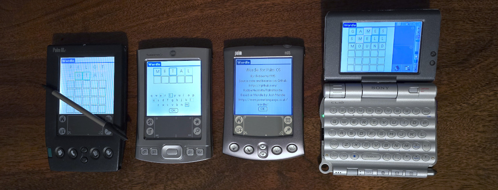
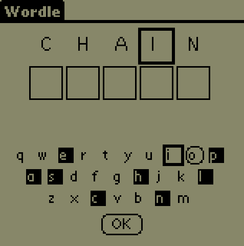
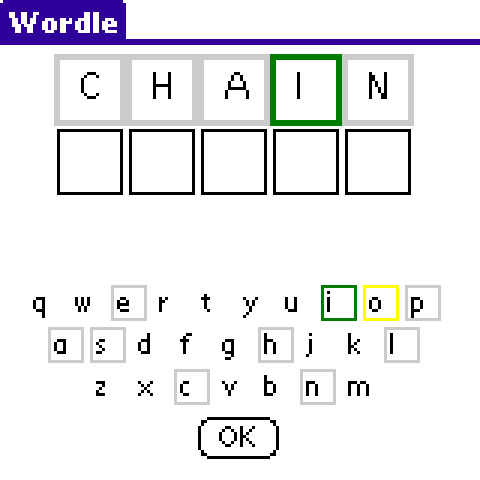

# PalmWordle

## About
In a fit of madness, I have ported the web game [WORDLE](https://www.powerlanguage.co.uk/wordle/) by Josh Wardle to Palm OS devices.
WORDLE is a game where you try to five letter word. After each guess you are told whether your letters are not in the word, in the word but in the wrong place, or in the correct place.
You have six guesses to get the hidden word. There is a new word each day.

## Building

I am using [PRC Tools Remix](https://github.com/jichu4n/prc-tools-remix) to build on Ubuntu WSL.
This project is using ANSI C.

## How To Play

Every day a new word is available for you to guess. When you enter a word, the tiles change to show how close your guess is to the correct word. If a letter has a grey border or is not highlighted, it is not in the word. You have six guesses to correctly guess the word.

Once you have entered your guess, use Graffiti or your keyboard to hit enter. You can also use the D-pad center button or press in on the rocker if these are available.

| letter state | black and white devices| color devices |
|---|---|---|
| Not guessed |  |  |
| In the word but in the wrong location |  |  |
| Correct |  |  |

You can also view your previous letter guesses on a keyboard by selecting "Show Keyboard" from the "Game" menu. Similar styles are used to show which letters have been guessed, but on black and white devices, inverted letters means that they are not in the word.
| black and white | color |
|---|---|
|  |  |

## Supported Devices

It doesn't work on older devices due to various API incompatibilities, but anything above Palm OS 3.5 should work just fine.

Here is a list of devices that it has been tested on (Feel free to open a PR if your device works and isn't on this list!)

### Alphasmart
- Dana Wireless (OS 4.1)

### Fossil
- Abacus AU5005 (OS 4.1)

### Palm
- III (4.1)
- IIIc (3.5)
- M100 (3.5.1)
- M105 (3.5.1)
- M505 (4.0)
- M515 (4.1)
- Tungsten C (5.2.1)
- Tungsten E (5.2.1)
- Tungsten T3 (5.2.1)
- T|X (5.4.9)

### Sony
- CLIÉ NX70V (OS 5.0)
- CLIÉ PEG-SL10/E (OS 4.0)
- CLIÉ PEG-UX50 (5.2)
